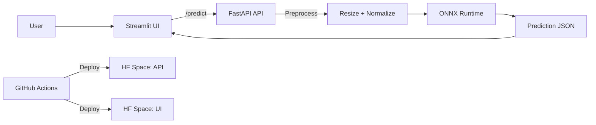

# Insect Detector MLOps

[](https://github.com/Tritad/insect-detector-mlops/actions/workflows/ci-cd.yml)


โปรเจกต์นี้เป็นระบบจำแนกภาพแมลงแบบ end-to-end สำหรับงาน MLOps โดยแยกเป็น API และ UI คนละ Space บน Hugging Face พร้อม CI/CD, ONNX inference, และชุดทดสอบประสิทธิภาพด้วย JMeter

## ภาพรวมระบบ

- API service: FastAPI สำหรับรับภาพและส่งผลทำนายที่ `/predict`
- UI service: Streamlit สำหรับอัปโหลดภาพและแสดงผลแบบอ่านง่าย
- Model runtime: ONNX + onnxruntime เพื่อให้รันบน CPU ได้เบาและเร็ว
- Deployment: GitHub Actions deploy อัตโนมัติไปยัง Hugging Face Spaces
- Performance test: JMeter สำหรับทดสอบ throughput, latency และ error rate

## Tech Stack

- API: FastAPI, Pydantic
- UI: Streamlit
- Model runtime: ONNX Runtime, NumPy, Pillow
- MLOps/CI: GitHub Actions, Hugging Face Spaces
- Testing/QA: Pytest, JMeter, Postman

## Architecture Diagram



## สิ่งที่ทำได้

- อัปโหลดภาพแมลงหลายไฟล์พร้อมกัน
- ทำนายชนิดแมลงด้วยโมเดลที่ fine-tune มาแล้ว
- แสดงชื่อแมลงทั้งภาษาไทยและภาษาอังกฤษ
- แสดง confidence, อาการทำลาย, และคำแนะนำสารออกฤทธิ์เบื้องต้น
- มี health check และ root endpoint สำหรับตรวจสถานะบริการ

## สถานะล่าสุด

- API Space: https://mhrt03-insect-detector-demo.hf.space
- UI Space: https://mhrt03-insect-detector-ui.hf.space
- CI/CD: รันทดสอบก่อน deploy อัตโนมัติบน branch `main`
- Model format: ONNX สำหรับใช้งานจริงบน Hugging Face Spaces

## โครงสร้างโปรเจกต์

- `app/` - FastAPI backend
- `ui/` - Streamlit frontend
- `scripts/` - สคริปต์ export / optimize / train
- `tests/` - unit tests และ performance artifacts
- `.github/workflows/` - GitHub Actions pipeline
- `model/` - ไฟล์โมเดลและ preprocessor configuration

## รันโปรเจกต์แบบ Local

### ใช้ Docker Compose
```bash
docker compose up --build
```

### URLs ที่ใช้ทดสอบ
- API: http://localhost:8000
- UI: http://localhost:8501

### cURL Commands

ตรวจสอบสถานะ API บน Local Docker:
```bash
curl.exe http://127.0.0.1:8000/health
```

เรียก `/predict` บน Local Docker พร้อมส่งไฟล์ภาพจริง:
```bash
curl.exe -X POST "http://127.0.0.1:8000/predict" \
  -F "file=@tests\performance\test_images\sample.jpg;type=image/jpeg"
```

ตรวจสอบสถานะ API บน Hugging Face Space:
```bash
curl.exe https://mhrt03-insect-detector-demo.hf.space/health
```

เรียก `/predict` บน Hugging Face Space พร้อมส่งไฟล์ภาพจริง:
```bash
curl.exe -X POST "https://mhrt03-insect-detector-demo.hf.space/predict" \
  -F "file=@tests\performance\test_images\sample.jpg;type=image/jpeg"
```

### Example Response JSON
```json
{
  "prediction_class": 12,
  "confidence": 0.9876,
  "status": "success"
}
```

## การพัฒนาและปรับแต่งโมเดล

### Export เป็น ONNX
```bash
python scripts/export_onnx.py
```

### Optimize และ benchmark
```bash
python scripts/optimize.py
```

สคริปต์นี้จะสรุปผลเปรียบเทียบ เช่น:

- Original model latency และขนาดไฟล์
- ONNX latency และขนาดไฟล์
- Quantized ONNX latency และขนาดไฟล์

ผลลัพธ์สำหรับทำรายงานจะถูกบันทึกไว้ที่ `reports/optimization_metrics.csv`

## CI/CD

ไฟล์ workflow หลักอยู่ที่ `.github/workflows/ci-cd.yml`

ลำดับการทำงานของ pipeline มีดังนี้:

- รัน `pytest` ทุกครั้งที่ push หรือเปิด pull request
- ถ้าทดสอบผ่านและ push ไปที่ `main` จะ deploy ไปยัง Hugging Face Spaces อัตโนมัติ
- แยก deploy เป็น 2 ส่วน คือ API Space และ UI Space

Repository secrets ที่ต้องตั้งค่า:

- `HF_TOKEN` - Hugging Face access token ที่มีสิทธิ์เขียน
- `HF_SPACE_REPO` - repo ของ API Space ในรูปแบบ `username/space_name`
- `HF_UI_SPACE_REPO` - repo ของ UI Space ในรูปแบบ `username/space_name`

## Performance Testing

ไฟล์สำหรับทดสอบโหลดอยู่ที่:

- JMeter plan: `tests/performance/insect_api_loadtest.jmx`
- ผลทดสอบ: `tests/performance/`

ดูผลจาก dashboard ของ JMeter ได้ตามตัวชี้วัดต่อไปนี้:

- Throughput (TPS)
- Latency (P95)
- Error rate

ตัวอย่างการรัน JMeter:

PowerShell (ใช้ backtick ต่อบรรทัด):

```powershell
# Local
jmeter -n -t tests/performance/insect_api_loadtest.jmx `
  -Jtarget=local `
  -Jimage_path="C:/Users/Acer/Desktop/insect-detector-mlops/data/ip102/classification/test/0/00000.jpg" `
  -l tests/performance/local_result.jtl

# Cloud (Hugging Face Space)
jmeter -n -t tests/performance/insect_api_loadtest.jmx `
  -Jtarget=cloud `
  -Jimage_path="C:/Users/Acer/Desktop/insect-detector-mlops/data/ip102/classification/test/0/00000.jpg" `
  -l tests/performance/cloud_result.jtl
```

คำสั่งแบบบรรทัดเดียว (PowerShell หรือ Bash):

```bash
jmeter -n -t tests/performance/insect_api_loadtest.jmx -Jtarget=cloud -Jimage_path="C:/Users/Acer/Desktop/insect-detector-mlops/data/ip102/classification/test/0/00000.jpg" -l tests/performance/cloud_result.jtl
```

หมายเหตุ: ยังสามารถ override ค่า `protocol`, `host`, `port` ได้ด้วย `-Jprotocol=... -Jhost=... -Jport=...`

## หมายเหตุการใช้งาน

- UI จะเรียก API Space เพื่อขอผลทำนาย
- ถ้าไม่มี `st.secrets` ระบบ UI จะ fallback ไปยังค่าเริ่มต้นที่กำหนดไว้
- ควรใช้ภาพแมลงที่มีความคมชัดพอสมควรเพื่อให้ผลทำนายแม่นขึ้น

## ไฟล์สำคัญ

- `app/main.py` - FastAPI inference service
- `ui/app.py` - Streamlit interface
- `requirements-space.txt` - dependencies สำหรับ API Space
- `requirements-ui-space.txt` - dependencies สำหรับ UI Space
- `tests/test_api.py` - unit tests ของ API

## License / Usage

โปรเจกต์นี้จัดทำขึ้นเพื่อการศึกษา วิจัย และสาธิตแนวทางการพัฒนาระบบ MLOps สำหรับงาน image classification เป็นหลัก หากจะนำไปใช้งานจริง ควรทดสอบกับข้อมูลจริงและตรวจสอบการเลือกสารเคมีตามข้อกำหนดท้องถิ่นก่อนเสมอ
